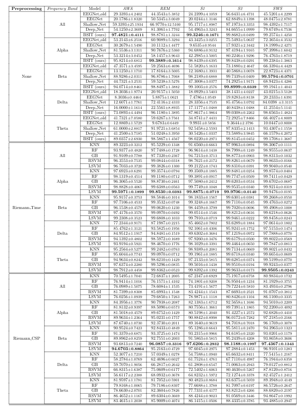
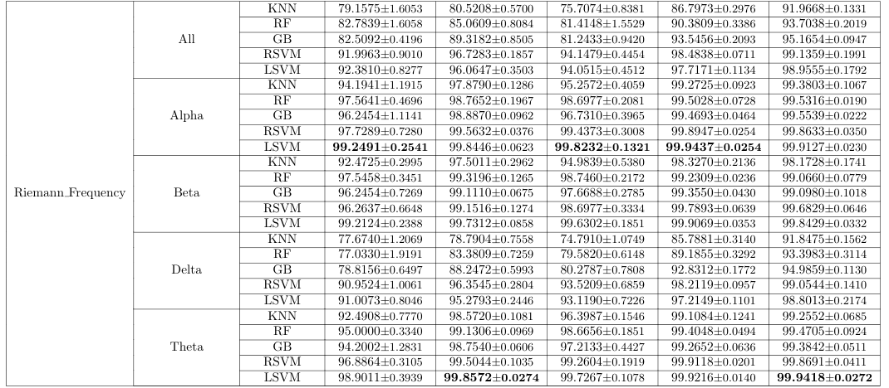
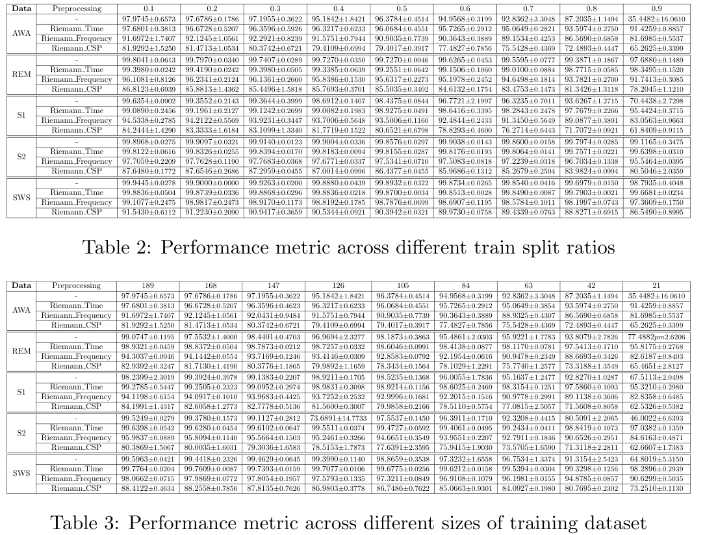

# Brain-based-Subject-Identification

The code repository for the project - Brain Based Subject Identification. This work was performed during my internship at Universty of Montreal under Projessor Jerbi.
The major contributions of this work are as follows:
* We reproduce works such as [EEGNet](http://stacks.iop.org/1741-2552/15/i=5/a=056013), [EEGNet_Old](http://stacks.iop.org/1741-2552/15/i=5/a=056013), [DeepConvNet](https://onlinelibrary.wiley.com/doi/full/10.1002/hbm.23730) and [ShallowConvNet](https://onlinelibrary.wiley.com/doi/full/10.1002/hbm.23730) as well as our very own architecture called BSIT.
* We test the performance of these deep learning models without any preprocessing on various datasets, including AWA, REM, S1, S2 and SWS and also at different frequency ranges, Alpha, Beta, Delta, Theta and All.
* We also test ML models such as K-Nearest Neighbors, Random Forest, Gradient Boosting, and Support Vector Machines (with Radial and Linear kernel functions) on the same datasets with a domain-induced pre-processing. ([Riemann Time](https://github.com/pyRiemann/pyRiemann), [Riemann Frequency](https://github.com/pyRiemann/pyRiemann) and [Riemann CSP](https://hal.archives-ouvertes.fr/file/index/docid/681328/filename/Barachant_tbme_final.pdf)).
* We also test these models against there train-split ratio to induce the minimum amount of data needed for the model to make sound results.
* The novelty of this repository is its extension to evaluate the attribution problem for subject identification. We study various attribution methods such as- Analyzing activations, and Deep dream.

In this repo, we share our codes from our experiment settings for different sleep stages - AWA, REM, S1, S2 and SWS. The codes have been simplified and have been segregated based on the dataset, for easy use and understanding.

### Requirements

* Python == 3.7 or 3.8
* tensorflow == 2.X (verified working with 2.0 - 2.3, both for CPU and GPU)
* mne >= 0.17.1
* PyRiemann >= 0.2.5
* scikit-learn >= 0.20.1
* matplotlib >= 2.2.3
* torch >= 1.4.0

## Results
### Reproducing models with different pre-processings




### Train-test experiment



### Other Results
All other results including activations, and performance metrics have been saved in `plots`.


# Paper Citation

If you use the EEGNet model in your research and found it helpful, please cite the following paper:

```
@article{Lawhern2018,
  author={Vernon J Lawhern and Amelia J Solon and Nicholas R Waytowich and Stephen M Gordon and Chou P Hung and Brent J Lance},
  title={EEGNet: a compact convolutional neural network for EEG-based brain–computer interfaces},
  journal={Journal of Neural Engineering},
  volume={15},
  number={5},
  pages={056013},
  url={http://stacks.iop.org/1741-2552/15/i=5/a=056013},
  year={2018}
}
```

If you use the SSVEP variant of the EEGNet model in your research and found it helpful, please cite the following paper:

```
@article{Waytowich2018,
  author={Nicholas Waytowich and Vernon J Lawhern and Javier O Garcia and Jennifer Cummings and Josef Faller and Paul Sajda and Jean M
Vettel},
  title={Compact convolutional neural networks for classification of asynchronous steady-state visual evoked potentials},
  journal={Journal of Neural Engineering},
  volume={15},
  number={6},
  pages={066031},
  url={http://stacks.iop.org/1741-2552/15/i=6/a=066031},
  year={2018}
}

```

Similarly, if you use the ShallowConvNet or DeepConvNet models and found them helpful, please cite the following paper:

```
@article{hbm23730,
author = {Schirrmeister Robin Tibor and
          Springenberg Jost Tobias and
          Fiederer Lukas Dominique Josef and
          Glasstetter Martin and
          Eggensperger Katharina and
          Tangermann Michael and
          Hutter Frank and
          Burgard Wolfram and
          Ball Tonio},
title = {Deep learning with convolutional neural networks for EEG decoding and visualization},
journal = {Human Brain Mapping},
volume = {38},
number = {11},
pages = {5391-5420},
keywords = {electroencephalography, EEG analysis, machine learning, end‐to‐end learning, brain–machine interface, brain–computer interface, model interpretability, brain mapping},
doi = {10.1002/hbm.23730},
url = {https://onlinelibrary.wiley.com/doi/abs/10.1002/hbm.23730}
}
```
